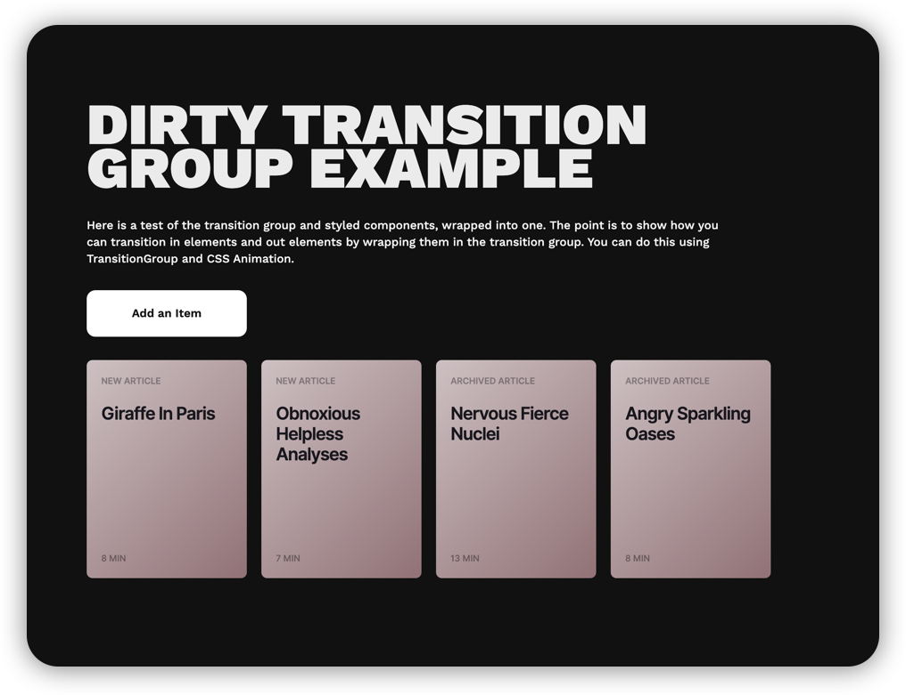
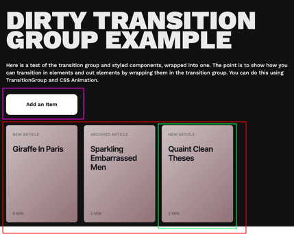
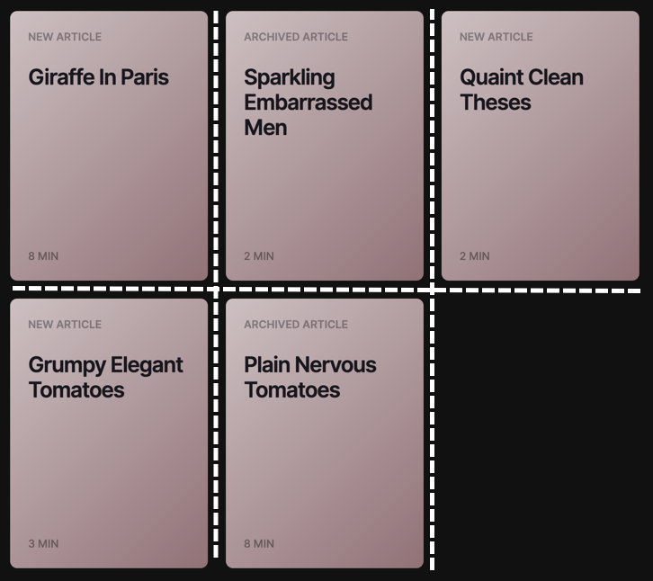
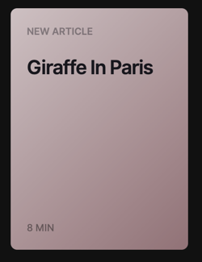

This project was bootstrapped with [Create React App](https://github.com/facebook/create-react-app).

# Transition Group Example
This is an example application using

* [React Transition Group](https://github.com/reactjs/react-transition-group)
* [Styled Components](https://github.com/styled-components/styled-components)
* [React Hooks](https://reactjs.org/docs/hooks-reference.html)

# The App
<br />
This app builds a very simple application to showcase transitions in and out of individual items within a transition group.

* Click the Add Button to see an item transition in
* Click on the individual item to see it transition out

The main secret sauce is the React-Transition-Group, which allows us to apply classes to enable CSS animations as components are added or removed. In this example a few classes are applied on enter and exit of a Tile.

```
transition-enter
transition-enter-active
transition-exit
transition-exit-active
```

`<TransitionGroup>` needs to be a direct parent to any `<CSSTransition>` children, otherwise the behavior begins to get wonky.

# Structure of the App
## App.js
<br />
The App component uses react hooks to store the state and also contains the `addItem()` and `removeItem()` functions, which update the state with an updated item list. These two functions are passed via props down the application to where they need to go, as opposed to using context.

### AddButton.js
<br />
The add button receives the `addItem()` function and runs this function `onClick`.

### TileGroup.js
<br />
The tile group uses CSS grid to show the grid of tiles. It utilizes `grid-template-columns: repeat(auto-fill, 220px);` to keep the layout responsive by flowing items based on the size of the div. I set the `component` attribute of `<TransitionGroup>` to `<StyledTile>` to ensure I didn't need an additional div in the DOM.

This is where the primary implementation of Transition Group is done. A parent `TransitionGroup` component holds the child `CSSTransition` children, which specifies a base class for the CSS transition classes (`classNames="transition"`) creates transition-enter, transition-enter-active, etc.

### Tile.js
<br />
Receives the `removeItem()` function via props, becoming the `onClick` handler. Also gets populated with dummy data provided within the `addItem()` function to show title, subtitle, and readtime.

### helpers.js
I used a modified helper function from one of [Wes Bos' React Courses](https://github.com/wesbos/React-For-Beginners-Starter-Files) to generate random strings to fill the tiles with, just to make the solution look a bit more realistic and appealing.


## Available Scripts

Per usual, use npm install to get all the dependencies. In the project directory, you can run:

### `npm start`

Runs the app in the development mode.<br />
Open [http://localhost:3000](http://localhost:3000) to view it in the browser.

The page will reload if you make edits.<br />
You will also see any lint errors in the console.

